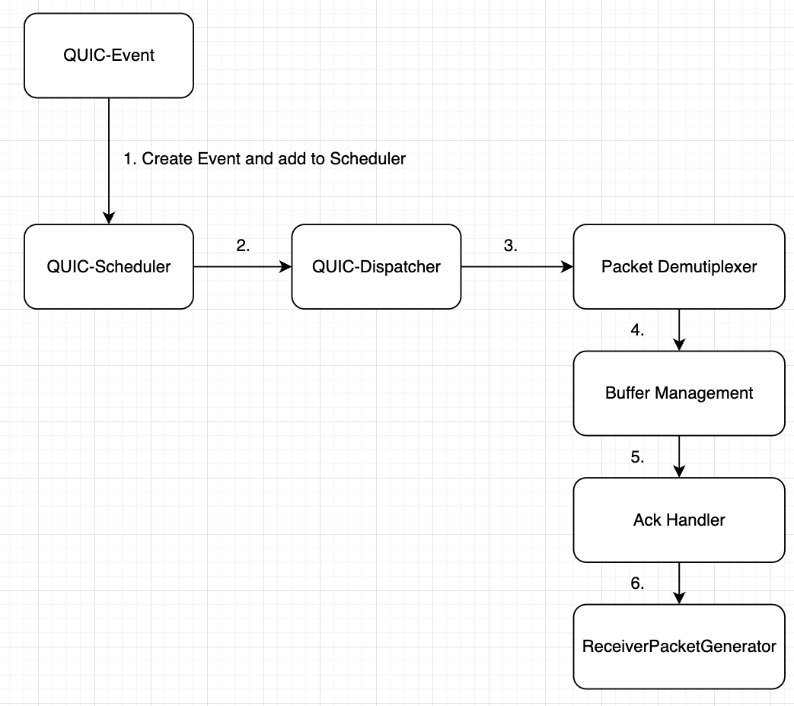

# QUIC Modular-Transport Implementation on ns3

ns3 is the network simulator used in this project. We implement the QUIC transport layer protocol according to modular transport programming model.

## Code Structures

Most of the files are from the ns3 open source project which we don't need to care much about for our implementation purpose. There are several folders that we need to know to start contributing.

### Modular Transport

Modular transport is the generalized programming model used for all transport layer protocols.
`/contrib/modular-transport` contains all the implementation for this. Specifically, we care about the code inside `helper/` and `model/` folders.

### QUIC-Protocol Implementation

QUIC is a specific protocol for transport layer. In this implmentation, all QUIC classes inherit from the Modular Transport Model (e.g. child class of classes inside modular transport).

`/contrib/QUIC-protocol` contains all the implmentation for this. Similarly, we care about the code inside `helper/` and `model/` folders.

Note: Some common patterns being used so far is, for specific event processors, the implmentation are inside the `helper/` folder.

### Test Cases

The testing code are inside `/scratch/quic_mt_test/quic_mt_test.cc`, which starts the simulator (e.g. start modular transport) and run the pre-defined testing.

### Other Useful Files

You might find some of the ns3 code useful. 

For example, we use the `Packet` class from ns3 and the implmentation is in `/src/network/model/packet.cc`.


## Pre-requisites
1. Make sure you are inside the school server and you are one the **green node**.
2. Clone this repository. e.g. `git clone https://github.com/minmit/ns-3-dev-git.git`

We need to first build the ns3. First run 
```shell
./ns3 configure --enable-examples
```
Then you need to run
```shell
./ns3
```

## Running Locally
 
In order to run test locally, run
```shell
./ns3 run quic_mt_test
```

## Andrew Zang's QUIC Receiver Implementation Walk Through


All the testing events are added and tested in `/scratch/quic_mt_test/quic_mt_test.cc`.

1. `QUIC-Event` has a `ReceiverEventCreator`, we use this function to create receving packet event, and the event is added to the `QUIC-Scheduler`.
2. The `QUIC-scheduler`, will see the newly created event and pass it to `QUIC-Dispatcher`.
3. `QUIC-Dispatcher` check which type of event it is and add some event processors that correspond to process the event. In our case for the receiver, it will append a chain of event processors.
4. `QUIC-Packet-Demultiplexer` is the first event processor that is called. It is responsible for demultiplex the packet into frames, which are stored inside intermediate output.
5. `QUIC-Buffer-Management` is the second event processor. It sees the frames created from the previous event processor, and put them into the correct stream. Moreover, it also generates some flow control frames that need to be send.
6. `QUIC-Receiver-Ack-handler` is the third event processor. It gets the packet number from intermediate output (from packet demultiplexer) and update receivedPackets intervals which we keep track of inside `QUIC-Context`. Moreover, it is also responsible for generating the correct ACK frame.
7. `QUIC-Receiver-Packet-Generator` is the last event processor. At this stage, all necessary frames are generated and stored in intermediate output. This event processor will take these frames and generate packets that needed to be send to the other side. All generated packets will be seen by modular transport and modular transport will send them to the other side.

### Extra points

All hard coded values are stored inside `QUIC-Context`. e.g. when receiver generates packets to be sent, we force a maximum of 5 frames per packet.

ReceivedPackets is an array of intervals used to manage packet number we seen so far. For example, if `receivedPackets = [[1, 3], [5, 5]]`, it means that we have seen packet number 1, 2, 3, 5 so far. This is useful when generating ACK frame from the receiver.

Frames and Packet. A QUIC Packet can contains several frames of different types. Each frame has their own functionalities. In our codebase, `QUIC-Header` is the header at packet level. There are short header and long header. The long header is used for establishing the connection and all other packets will use the short header. Each frame also has its own header, which is inside `QUIC-Frame`.

More of this information can be found inside RFC9000.

### Contribution Notes/Todos

Most of the sender side logics are completed and 99% of the receiver side logics are completed. However there are some other things that need to be implemented.

The sender and receiver side can run their testing on their own (e.g. inside the `quic_mt_test.cc`, we comment out the sender's test case to run the receiver side and vice versa). As a result we need to combine the logics to run the server and sender together.

Consider changing the code inside the following files
- `/contrib/modular-transport/model/modular-transport.cc`
- `/scratch/quic_mt_test/quic_mt_test.cc`

Before doing so, the sender side's code need to change a bit. All the `QUIC-Frame` and `QUIC-Packet` code are property implmentation after writing the sender side's logic. The receiver side uses the up-to-date `QUIC-Frame` and `QUIC-Packet` so most likely you don't need to worry too much on the receiver side. Notice that the `QUIC-Frame` contains deprecated code used by the current sender which needs to be deleted.

There might be other things that need to be implmented that I'm not aware of.

Note that if you are adding a new file (e.g. new `.cc` or `.h`), add them to the `CMakeLists.txt` in the corresponding folder.

**the rest of the documentation are from ns3 simulator, you might find them useful**

# The Network Simulator, Version 3

## Table of Contents

1) [An overview](#an-open-source-project)
2) [Building ns-3](#building-ns-3)
3) [Running ns-3](#running-ns-3)
4) [Getting access to the ns-3 documentation](#getting-access-to-the-ns-3-documentation)
5) [Working with the development version of ns-3](#working-with-the-development-version-of-ns-3)

> **NOTE**: Much more substantial information about ns-3 can be found at
<https://www.nsnam.org>

## An Open Source project

ns-3 is a free open source project aiming to build a discrete-event
network simulator targeted for simulation research and education.
This is a collaborative project; we hope that
the missing pieces of the models we have not yet implemented
will be contributed by the community in an open collaboration
process.

The process of contributing to the ns-3 project varies with
the people involved, the amount of time they can invest
and the type of model they want to work on, but the current
process that the project tries to follow is described here:
<https://www.nsnam.org/developers/contributing-code/>

This README excerpts some details from a more extensive
tutorial that is maintained at:
<https://www.nsnam.org/documentation/latest/>

## Building ns-3

The code for the framework and the default models provided
by ns-3 is built as a set of libraries. User simulations
are expected to be written as simple programs that make
use of these ns-3 libraries.

To build the set of default libraries and the example
programs included in this package, you need to use the
tool 'ns3'. Detailed information on how to use ns3 is
included in the file doc/build.txt

However, the real quick and dirty way to get started is to
type the command

```shell
./ns3 configure --enable-examples
```

followed by

```shell
./ns3
```

in the directory which contains this README file. The files
built will be copied in the build/ directory.

The current codebase is expected to build and run on the
set of platforms listed in the [release notes](RELEASE_NOTES.md)
file.

Other platforms may or may not work: we welcome patches to
improve the portability of the code to these other platforms.

## Running ns-3

On recent Linux systems, once you have built ns-3 (with examples
enabled), it should be easy to run the sample programs with the
following command, such as:

```shell
./ns3 run simple-global-routing
```

That program should generate a `simple-global-routing.tr` text
trace file and a set of `simple-global-routing-xx-xx.pcap` binary
pcap trace files, which can be read by `tcpdump -tt -r filename.pcap`
The program source can be found in the examples/routing directory.

## Getting access to the ns-3 documentation

Once you have verified that your build of ns-3 works by running
the simple-point-to-point example as outlined in 3) above, it is
quite likely that you will want to get started on reading
some ns-3 documentation.

All of that documentation should always be available from
the ns-3 website: <https://www.nsnam.org/documentation/>.

This documentation includes:

- a tutorial
- a reference manual
- models in the ns-3 model library
- a wiki for user-contributed tips: <https://www.nsnam.org/wiki/>
- API documentation generated using doxygen: this is
  a reference manual, most likely not very well suited
  as introductory text:
  <https://www.nsnam.org/doxygen/index.html>

## Working with the development version of ns-3

If you want to download and use the development version of ns-3, you
need to use the tool `git`. A quick and dirty cheat sheet is included
in the manual, but reading through the git
tutorials found in the Internet is usually a good idea if you are not
familiar with it.

If you have successfully installed git, you can get
a copy of the development version with the following command:

```shell
git clone https://gitlab.com/nsnam/ns-3-dev.git
```

However, we recommend to follow the Gitlab guidelines for starters,
that includes creating a Gitlab account, forking the ns-3-dev project
under the new account's name, and then cloning the forked repository.
You can find more information in the [manual](https://www.nsnam.org/docs/manual/html/working-with-git.html).
